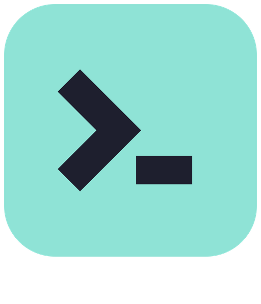
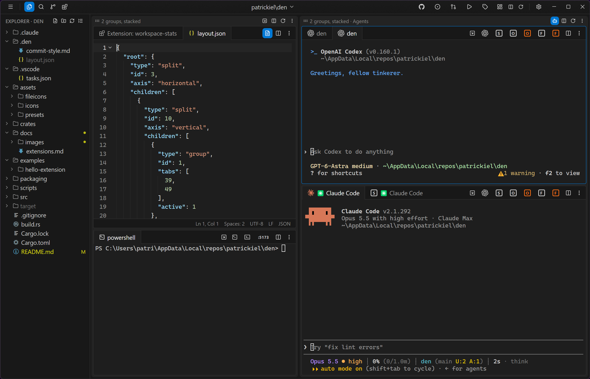

#  den

**A project terminal for Windows and macOS.** Open a folder and get terminals, coding agents, an editor, a browser, search and git side by side in one native window. The layout is saved with the project.

[](https://github.com/patrickiel/den/releases/latest)
[](https://github.com/patrickiel/den/releases/latest)
[](https://www.gpui.rs)



## Why den

Most days now go like this: a couple of coding agents running in terminals, a dev server, a browser on `localhost`, and now and then a file to read or a diff to check. den is built for that loop.

- **Compared with Windows Terminal + VS Code:** VS Code is an editor with a terminal panel at the bottom. den puts terminals first and editor tabs next to them, in the same splits. You can also open a terminal and a file in the same group.
- **Compared with WezTerm and other multiplexers:** you get splits and tabs as well, plus a file tree, search, source control and a real browser, with no Lua config to write.
- **The project carries its own setup:** groups, splits and tabs are saved to `.den/layout.json` in the folder. The next time you open that folder, it comes back exactly as you left it, agents and all.

## Features

- **Terminals.** Each one runs on ConPTY (a pty on macOS) with alacritty's parser and follows your PowerShell, zsh or bash prompt from folder to folder, in WSL as well. URLs and `path:line:col` references open with Ctrl+click (Cmd+click on a Mac).
- **Agents as first-class tabs.** Claude Code, Codex, a dev server or any other command can become a one-click button on every tab strip. When an agent finishes or needs input in a tab you aren't looking at, den marks the tab, plays a sound and flashes the taskbar (bounces the Dock icon on a Mac). Claude Code sessions resume when den restarts.
- **Flexible layout.** Groups of tabs sit in nested splits, and groups can be dragged around or moved into floating windows. A group can be maximized over the whole window, sidebar and all unless a setting keeps the sidebar clear (Ctrl+K Ctrl+M), or maximized as tiles with every one of its tabs live in a grid (Ctrl+K Ctrl+T). Per tab kind, you can pick a group where new tabs of that kind open ("agents go on the right"), and you can save named layout presets.
- **Editor.** Tree-sitter highlighting for Rust, TypeScript/TSX, JavaScript, Python, Svelte, HTML, CSS, Markdown, TOML, YAML and Bash. Changed lines are marked in the gutter against git. Encodings and indentation are detected. Format Document runs whatever formatter the project already uses (Prettier, rustfmt, Ruff, gofmt, and others).
- **Browser tabs.** A real browser (WebView2 on Windows, WebKit on macOS) sits in a tab next to your code. Logins persist in den's own profile, and type `localhost:5173` to open your dev server.
- **Explorer and Search.** A file tree with git status. Search shows results as you type and supports regex, case and whole-word matching, include/exclude globs and replace. It respects `.gitignore`.
- **Source control.** Stage, commit, pull and push, with side-by-side diffs and a commit graph. **Commit messages can be generated by a small model that runs on your machine**: llama.cpp is downloaded the first time you use it, and the message follows the repo's own `.den/commit-style.md`.
- **VS Code's keys.** The shortcuts are VS Code's on each platform (Ctrl+Shift+P for every command, Ctrl+B, Ctrl+\\, Ctrl+K chords, Alt+1…9 for tabs, Ctrl+1…8 for groups), and every one can be changed in Settings → Keyboard Shortcuts (Ctrl+K Ctrl+S) by typing the new keys. Hold Ctrl a moment and every group shows its number; hold Alt and the tabs show theirs. The group or tab the keys take you to flashes its border. In a terminal, a plain Ctrl+letter still goes to the program running there, so Ctrl+W, Ctrl+O and Ctrl+R work in your shell and in Claude Code.
- **Themes and extensions.** Drop in any VS Code color theme JSON. Extensions are Rust dynamic libraries that can be installed from the Extensions view by typing `owner/repo`.
- **Self-updating.** den checks GitHub Releases, verifies the installer's signature and restarts itself into the new version.

## Install

### Windows

1. Download `den_<version>_x64-setup.exe` from the [latest release](https://github.com/patrickiel/den/releases/latest).
2. Run it. It installs for your user only, into `%LOCALAPPDATA%\Programs\den`, with no admin prompt.
3. Open den, pick a project folder, and click the **Claude Code** button on the tab strip (or open a plain terminal).

You'll also need:

- **Git** on your `PATH` for Source Control. den runs your own `git`, so your hooks, credential helpers and LFS all work as usual.
- **WebView2** for browser tabs. It ships with Windows 11 and is a [free download](https://developer.microsoft.com/microsoft-edge/webview2/) for Windows 10.

Settings and app state are kept in `%APPDATA%\den\`. Each project's layout is kept in its own `.den\` folder.

#### WSL

Set the shell (Settings) to `wsl`, or `wsl -d Ubuntu` for a particular distribution, and terminals open in WSL with your own bash or zsh setup. Leave it empty and a folder inside WSL (`\\wsl.localhost\Ubuntu\home\you\project`) opens its terminals there by itself. Either way the tab follows your prompt from folder to folder, and Claude Code running in WSL marks its tab when it finishes or needs input, as it does on Windows.

A project inside WSL works like any other: Source Control runs the distribution's own `git` (your Linux config, hooks and credentials), and the Explorer, git status and open files follow changes made in WSL. Changes are picked up within a second, or as they happen with `inotify-tools` installed in the distribution. Format Document still uses the formatters installed on Windows.

### macOS (Apple Silicon)

1. Download `den_<version>_aarch64.dmg` from the [latest release](https://github.com/patrickiel/den/releases/latest), open it and drag `den` onto the Applications folder.
2. den is signed ad hoc, not notarized (there is no Apple Developer ID behind it), so the first start needs one extra step: right-click `den.app`, choose **Open** and confirm, or run `xattr -d com.apple.quarantine /Applications/den.app`. Updates den installs itself need neither. (The `.app.tar.gz` next to the disk image is what the updater downloads.)
3. Open den, pick a project folder, and click the **Claude Code** button on the tab strip (or open a plain terminal).

Git comes with the Xcode Command Line Tools (`xcode-select --install`) or Homebrew. Browser tabs use the WebKit that ships with macOS. Started from the Finder or the Dock, den takes your login shell's `PATH` over, so `claude`, `pnpm` and the formatters it runs are the ones your terminal sees.

Settings and app state are kept in `~/Library/Application Support/den/`. Releases are built for both platforms by a GitHub Actions workflow and published together.

## Build from source

You'll need stable Rust (1.85 or newer, for edition 2024): on Windows the MSVC toolchain and the Visual Studio C++ build tools, on a Mac the Xcode Command Line Tools.

```powershell
git clone https://github.com/patrickiel/den
cd den
cargo run            # dev build; its icon is amber so you can tell it from the installed app
cargo build --release
```

On a Mac, `./scripts/bundle-macos.sh` turns the release build into `target/release/den.app` (icon, `Info.plist`, ad hoc signature), which is what the release ships.

Dependencies are compiled with optimizations even in dev builds, because GPUI is too slow to use without them. The `den` crate itself stays debuggable.

## Extensions

Extensions are Rust crates built on [`den-extension`](crates/den-extension). They load as dynamic libraries (a DLL, a dylib), each on its own thread, and they can add commands, keybindings, title-bar buttons, settings, toasts and whole views.

- Start with [`examples/hello-extension`](examples/hello-extension).
- Read the full guide in [`docs/extensions.md`](docs/extensions.md).
- Side-load a local build with `node scripts/sideload.ts examples/hello-extension`.

## Project layout

| Path | What's there |
| --- | --- |
| `src/` | The app: workspace and layout, panes, Explorer, Search, Source Control, terminal |
| `src/backend/` | Work done off the UI thread: git, search, file watching, extensions, downloads, local AI |
| `crates/den-extension/` | The extension API crate |
| `examples/` | Example extensions |
| `packaging/` | The NSIS installer script, the Mac bundle's `Info.plist` and the updater's public key |
| `scripts/` | Release, Mac bundling and side-load scripts |
