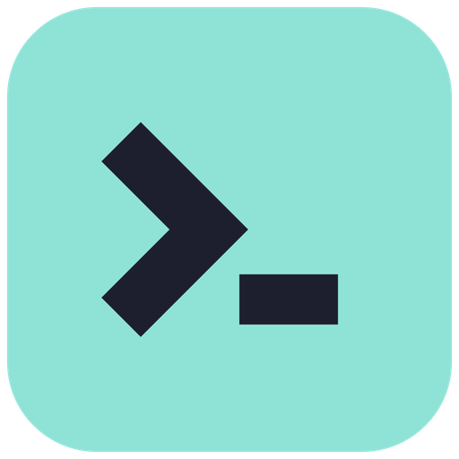

<div align="center">



# den

**A project terminal for Windows.**<br>
Terminals, agents, files and browsers in split panes, with an explorer, search and source control.<br>
Native Rust on [GPUI](https://gpui.rs), with no webview for the UI.

[](https://github.com/patrickiel/den/releases/latest)


[**Download**](https://github.com/patrickiel/den/releases/latest) ·
[Features](#features) ·
[Shortcuts](#keyboard-shortcuts) ·
[Extensions](#extensions) ·
[Building](#building-from-source)

<br>


</div>

---

## Why den

You open a project and need the same things every time: a shell or two, an agent such as Claude Code, the code itself, the app in a browser, and git. den puts all of them in one window, arranged as you like, per folder. Close it and the next time you open that folder everything is back: the layout, the scrollback, the browser pages, even the Claude Code conversation.

It is a native app on Zed's UI framework, so it stays responsive with many terminals running.

- **One layout per folder.** Groups of tabs in nested splits that you drag around freely. Each folder's layout is saved, and it is also written to `.den/layout.json` so it travels with the repository.
- **Built for agents.** Claude Code resumes its conversation when den restarts. When an agent finishes a turn or asks a question while you are looking elsewhere, den lets you know with a toast, a sound and a dot on the tab.
- **A real editor and browser.** A tree-sitter code editor with git gutter marks and formatting, and Chromium browser tabs next to your terminals.
- **Extensible.** Native extensions written in Rust, installable from a curated index.

## Install

Download **`den_<version>_x64-setup.exe`** from the [latest release](https://github.com/patrickiel/den/releases/latest) and run it. It installs for your user only, with no admin rights needed, into `%LOCALAPPDATA%\Programs\den`.

den keeps itself up to date. It checks for a new version shortly after starting (and from ☰ ▸ **Check for Updates**), verifies the installer's signature, installs it silently and restarts.

> [!NOTE]
> Browser tabs use the Microsoft Edge WebView2 runtime. It comes with Windows 11 and with current Windows 10.

## Getting started

1. Open a folder with **Open Folder…** in the session switcher (Ctrl+Shift+O), by dropping it on the window, or by passing it to `den.exe` on the command line.
2. Use the buttons at the end of any tab strip to open a shell, an agent, or a browser, or to split the group.
3. Drag tabs, groups and whole containers to arrange them. Drop one outside the window to give it a window of its own.
4. Save arrangements you like as **layout presets** in the title bar.

Recent folders are in the session switcher and in the taskbar's jump list.

## Features

### Layout and windows

- **Groups and containers.** Tabs live in groups, groups live in splits, and every split is a container you can grab by its header, flip, split or close. Drag a tab onto another group's strip to move it, into the middle to join the group, or onto a side to start a new group there.
- **Default groups.** Mark a group or container as the default for Files, Terminals, Agents or Browsers, and new tabs of that kind open there.
- **Floating windows.** As with VS Code's editor groups, drag a tab, group or container out of the window and it opens in a window of its own. Terminals keep running and browser pages go along. Floating windows are saved with the layout.
- **Sessions.** The layout is saved on every change and restored per folder. Closing with unsaved files asks first.
- **Right-click a tab** for Close Others / to the Right, Split Right / Down, Move into New / Main Window, and what that tab's kind offers (Copy Path, Reveal in File Explorer, Duplicate terminal, Open in Default Browser, …).

### Terminals and agents

- A real terminal: `pwsh` (or Windows PowerShell, or any shell you set) on ConPTY, parsed by `alacritty_terminal`. Full colour, alternate screen, mouse reporting, bracketed paste and scrollback, with block and box-drawing characters drawn as shapes.
- **Clickable links.** Ctrl+click URLs and `path:line:col`. Paths resolve against the shell's current folder, which it reports through an OSC 7 prompt hook.
- **Sessions survive restarts.** Scrollback comes back, and **Claude Code resumes its conversation** (`claude --resume <id>`, through its hooks). This also works for a `claude` you typed yourself.
- **Notifications.** When Claude Code finishes a turn or asks something, or a program sends OSC 9 or OSC 777 or rings the bell while you are looking elsewhere: a toast that takes you to the tab, a dot on the tab, a sound (Chime, Ping, Pop, Bell, Alert, Rise) and a taskbar flash. Each one can be switched off.
- **Presets** for terminals, agents and browsers, with icons (vendor logos, glyphs, letters, colours). Pinned presets get a button on every tab strip.

### Editor

- GPUI Kit's code editor: tree-sitter highlighting for Rust, JS/TS/TSX, JSON, Markdown, CSS, HTML, TOML, YAML, Python, Bash and Svelte, plus folding, indent guides and find.
- **Quick diff** marks in the gutter against the git index.
- **Preview tabs** (shown in italics) as in VS Code. A file that changes on disk reloads in place when it has no unsaved changes.
- A **status bar** for each file: go to line, indentation, encoding (reopen or save in another one), LF / CRLF and language mode.
- **Markdown and SVG previews** that include unsaved edits. Images open as pictures.
- **Format Document** (Shift+Alt+F) and format on save, using the project's own Prettier, rustfmt, Ruff/Black, gofmt, shfmt, clang-format, StyLua and more. If a formatter is missing, den offers to download a pinned, checksummed one (dprint and its plugins) into `%APPDATA%\den\tools`.

### Browser

- Chromium (WebView2) tabs inside a group: back, forward, reload and a URL bar that understands hosts, `localhost` and search terms.
- Links that would open a new window open as a browser tab instead.
- Tabs come back at their last URL, and logins persist in den's own profile.

### Explorer, search and source control

- **Explorer** with VS Code's Seti icons, git colours, change dots on folders and dimmed ignored files. It follows changes on disk.
- **Search** with regex, case and whole-word options and include / exclude globs. It respects `.gitignore`, streams results, and can replace per file or everywhere.
- **Source control** through the git CLI: switch and create branches, fetch, pull and push with ahead / behind counts, stage, unstage and discard, commit, amend, and commit & push. Changes open side by side, and the commit history expands to its files.
- **✨ AI commit messages from a local model.** On first use den downloads a pinned llama.cpp build and a small model (Qwen2.5-Coder 1.5B by default), runs it on localhost (GPU, else CPU) and streams the message in. The style comes from the repository's `.den/commit-style.md`, or is learned from its history and saved there. Your code never leaves your machine.

### Themes

Dark and Light Modern (VS Code's), and **Import…** for any VS Code colour theme. Imported themes set the window, the syntax colours and the terminal palette.

## Keyboard shortcuts

| | |
| --- | --- |
| <kbd>Ctrl</kbd>+<kbd>Shift</kbd>+<kbd>O</kbd> | Open folder |
| <kbd>Ctrl</kbd>+<kbd>O</kbd> | Open files |
| <kbd>Ctrl</kbd>+<kbd>Shift</kbd>+<kbd>T</kbd> | New terminal |
| <kbd>Ctrl</kbd>+<kbd>Shift</kbd>+<kbd>B</kbd> | New browser |
| <kbd>Ctrl</kbd>+<kbd>Shift</kbd>+<kbd>D</kbd> / <kbd>Ctrl</kbd>+<kbd>Shift</kbd>+<kbd>-</kbd> | Split right / down |
| <kbd>Alt</kbd>+<kbd>←</kbd><kbd>↑</kbd><kbd>→</kbd><kbd>↓</kbd> | Move between groups |
| <kbd>Ctrl</kbd>+<kbd>Tab</kbd> / <kbd>Ctrl</kbd>+<kbd>Shift</kbd>+<kbd>Tab</kbd> | Next / previous tab |
| <kbd>Ctrl</kbd>+<kbd>W</kbd> | Close tab (Ctrl+Shift+W in a terminal) |
| <kbd>Ctrl</kbd>+<kbd>Shift</kbd>+<kbd>Q</kbd> | Close group |
| <kbd>Ctrl</kbd>+<kbd>S</kbd> | Save |
| <kbd>Shift</kbd>+<kbd>Alt</kbd>+<kbd>F</kbd> | Format document |
| <kbd>Ctrl</kbd>+<kbd>Shift</kbd>+<kbd>E</kbd> / <kbd>F</kbd> / <kbd>G</kbd> / <kbd>X</kbd> | Explorer / Search / Source Control / Extensions |
| <kbd>Ctrl</kbd>+<kbd>Shift</kbd>+<kbd>H</kbd> | Replace in files |
| <kbd>Ctrl</kbd>+<kbd>,</kbd> | Settings |
| <kbd>Ctrl</kbd>+<kbd>Shift</kbd>+<kbd>C</kbd> / <kbd>V</kbd> | Copy / paste in a terminal |

## Extensions

den runs **native extensions written in Rust**. An extension is a `cdylib` built against [`crates/den-extension`](crates/den-extension) that talks to den through a small, versioned C ABI carrying JSON. It can show toasts, add title-bar buttons and menu commands with keybindings, run commands in a terminal, open files, and react to events such as `workspace_opened`, `active_file_changed` and `file_saved`. Each extension runs on its own thread and keeps working across den updates.

Open the **Extensions** view (<kbd>Ctrl</kbd>+<kbd>Shift</kbd>+<kbd>X</kbd>) to:

- browse **Available** extensions from the curated index, [patrickiel/den-extensions](https://github.com/patrickiel/den-extensions);
- install any extension from GitHub by typing `owner/repo`;
- switch extensions on and off, update, uninstall and configure them.

> [!WARNING]
> An extension is native code and runs with your permissions. den asks before installing one.

| Extension | What it does |
| --- | --- |
| [task-buttons](https://github.com/patrickiel/task-buttons) | Your `.vscode/tasks.json` as title-bar buttons |
| [workspace-stats](https://github.com/patrickiel/workspace-stats) | Files and languages per folder, and break reminders |
| [hello-extension](examples/hello-extension) | The minimal example |

**Writing one?** Start with [docs/extensions.md](docs/extensions.md).

## Building from source

You need Windows 10 or 11 (x64), a stable [Rust](https://rustup.rs) toolchain (edition 2024) and the MSVC build tools.

```sh
git clone https://github.com/patrickiel/den
cd den
cargo run --release -- <folder>     # no folder: the current directory
```

The first build compiles GPUI and the tree-sitter grammars and takes a few minutes. Dev builds optimise dependencies (`opt-level = 2`) because unoptimised GPUI is too slow to use. Debug builds carry an amber icon and never update themselves.

Run the tests with `cargo test --workspace`.

<details>
<summary><b>How the code is organised</b></summary>

<br>

| Path | |
| --- | --- |
| `src/workspace.rs` | The window: title bar, sidebar, routing of new tabs, sessions, presets, notifications |
| `src/layout.rs`, `src/defaults.rs` | The layout tree and default groups as plain data, with every edit on them. Unit tested |
| `src/layout_view.rs` | Draws the tree and handles every drag and drop |
| `src/float.rs` | A floating window, drawing its part of the tree |
| `src/layout_file.rs` | The folder's `.den/layout.json` |
| `src/pane.rs` | The `Pane` trait every tab kind implements, and the registry that rebuilds panes from a saved layout |
| `src/panels.rs`, `src/diff.rs`, `src/dirty_diff.rs` | File and Settings panes, diff tabs, gutter marks |
| `src/terminal/` | The terminal pane, its GPUI element, glyphs, links, OSC scanners, colours and keys |
| `src/browser.rs` | Browser tabs |
| `src/explorer.rs`, `src/search.rs`, `src/scm.rs`, `src/repo.rs` | The sidebar views |
| `src/theme.rs` | VS Code themes mapped onto the component theme, syntax colours and terminal palette |
| `src/extensions*.rs`, `src/extension_panel.rs` | Running extensions, the Extensions view, an extension's page |
| `src/backend/` | Work off the UI thread: `search`, `git`, `watch`, `format`, `agent` (Claude Code hooks), `ai` (llama.cpp), `commit_ai`, `extensions` |
| `crates/den-extension` | The SDK and C ABI extensions build against |

</details>

<details>
<summary><b>Where den keeps its data</b></summary>

<br>

Everything lives in `%APPDATA%\den\`:

| | |
| --- | --- |
| `settings.json`, `state.json` | Settings, sessions and layouts |
| `themes\` | Imported themes |
| `webview\` | The browser profile (cookies, logins) |
| `ai\`, `tools\` | Downloaded llama.cpp and models, downloaded formatters |
| `hooks\` | Claude Code hook scripts |
| `extensions\`, `extensions-data\` | Installed extensions and their data |
| `extensions.log` | How each extension started |

In a project folder, `.den/layout.json` holds the shareable layout (relative paths, no machine state) and `.den/commit-style.md` holds the commit message style.

</details>

<details>
<summary><b>Releasing</b> (maintainers)</summary>

<br>

```sh
node scripts/release.ts [--dry-run] [--yes] [--bump major|minor|patch]
```

Claude picks the bump (following `scripts/release-scale.md`) and writes the notes. The script then bumps `Cargo.toml`, builds, packs the per-user NSIS installer (`packaging/installer.nsi`), signs it with `~/.keys/den.key` (password in `DEN_SIGNING_KEY_PASSWORD`), writes `latest.json`, tags, and publishes a GitHub release. Installed copies verify updates against `packaging/updater.pub`.

</details>

## Known limitations

- Menus and toasts are drawn under a browser page, because the page is a native window. Dialogs and drags hide the page.
- Formatting uses the formatters installed on your machine or downloaded by den. Downloaded plugins use their own defaults, not the project's config.
- Windows only.

## History

den started as a Tauri + Svelte app up to v0.11.0 and was rewritten as a native GPUI app, starting again at v0.1.0. The old releases are tagged `tauri/v*`.

## Acknowledgements

den is built on [GPUI](https://gpui.rs) from the Zed team and [GPUI Kit](https://gpui-kit.com), with [alacritty_terminal](https://github.com/alacritty/alacritty), [portable-pty](https://github.com/wezterm/wezterm/tree/main/pty), [wry](https://github.com/tauri-apps/wry), [llama.cpp](https://github.com/ggml-org/llama.cpp) and [dprint](https://dprint.dev). Icons come from VS Code's [Seti](https://github.com/jesseweed/seti-ui) theme, [Phosphor](https://phosphoricons.com), [LobeHub Icons](https://github.com/lobehub/lobe-icons) and [Lucide](https://lucide.dev).
